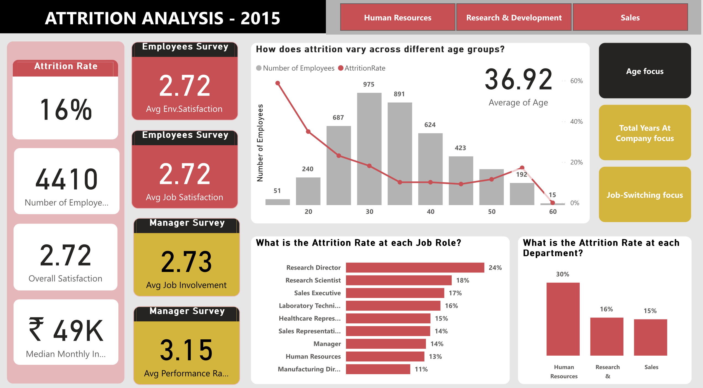

# Power BI
## 1. [HR Attrition analysis](https://app.powerbi.com/view?r=eyJrIjoiZmI3MjZiNGMtODk0ZC00MDQzLTk5M2UtY2E1ZmY3NTBhZjM3IiwidCI6ImFmMWYzNzUzLTM5MjUtNGU2Zi05NDliLTk3YzAwNzMyMDgwMyIsImMiOjEwfQ%3D%3D&pageName=b5e4741066eb5107931a&pageName=b5e4741066eb5107931a)
**Dashboard snapshot**

Page 2 of 6 of report, full interactive report 
<a href="https://app.powerbi.com/view?r=eyJrIjoiZmI3MjZiNGMtODk0ZC00MDQzLTk5M2UtY2E1ZmY3NTBhZjM3IiwidCI6ImFmMWYzNzUzLTM5MjUtNGU2Zi05NDliLTk3YzAwNzMyMDgwMyIsImMiOjEwfQ%3D%3D&pageName=b5e4741066eb5107931a&pageName=b5e4741066eb5107931a" target="_blank" rel="noopener noreferrer">here</a>

**User Story:**

An Indian pharmaceutical X (~4,000 employees), has observed an annual attrition rate of 15% in 2015, a figure significantly impacting operational efficiency and organizational continuity. The company engaged a professional data analytics firm to uncover the root causes and identify actionable insights to address the issue.

FYI: In human resources, attrition is the gradual reduction in an organization's workforce due to employees leaving for any reason. 

**Data preprocessing & Modelling**

Use Python & Power Querie Editor to preprocess and modelling data. Performed simple machine learning (Logistic regression) to predict attrition rate (y) base on model features (x), then evaluate the importance of each attribute (reason) contributing to employee attrition.

Based on the model's analysis of attribute importance, derive the top 3 hypotheses explaining why employees leave the company:

- Work-Life Balance: Long working hours and frequent overtime.
- Job Satisfaction: Low satisfaction with job roles or responsibilities.
- Workplace Environment: Challenges related to the overall work environment and conditions.

## 2. [Sale Performance Report](https://app.powerbi.com/view?r=eyJrIjoiNjllZmI1YWMtMTIxZS00ZGZhLWI0OWEtNjQyYzBlZmZhMjMxIiwidCI6ImFmMWYzNzUzLTM5MjUtNGU2Zi05NDliLTk3YzAwNzMyMDgwMyIsImMiOjEwfQ%3D%3D&pageName=4859907eacd94f1b10b9)
**Dashboard snapshot**:

Page 1 of 2 of report, full interactive report <a href="https://app.powerbi.com/view?r=eyJrIjoiZmI3MjZiNGMtODk0ZC00MDQzLTk5M2UtY2E1ZmY3NTBhZjM3IiwidCI6ImFmMWYzNzUzLTM5MjUtNGU2Zi05NDliLTk3YzAwNzMyMDgwMyIsImMiOjEwfQ%3D%3D&pageName=b5e4741066eb5107931a&pageName=b5e4741066eb5107931a" target="_blank" rel="noopener noreferrer">here</a> 
]

**User Story:**
As a Sales Manager, Adam wants to analyze the sales performance by profit, gross sales, COGS, discounts, and product profitability across different sale channel and time periods, so that he can identify areas of high performance, address inefficiencies, and strategize for better profitability.

**Dashboard element**: Provides insights into:

	1.	Overall Metrics: Profit, Gross Sales, COGS, and Discounts to track performance and profitability.
	2.	Segment Analysis: Profit and discounts by sales channels (e.g., Government, Enterprise) to identify top-performing areas.
	3.	Product Performance: Profitability and cost efficiency by product lines to highlight key contributors and areas for improvement.
	4.	Trends: Profit trends and KPI tracking to monitor performance against targets.
	5.	Positioning: Product profitability vs. costs to identify high-value products and inefficiencies.
