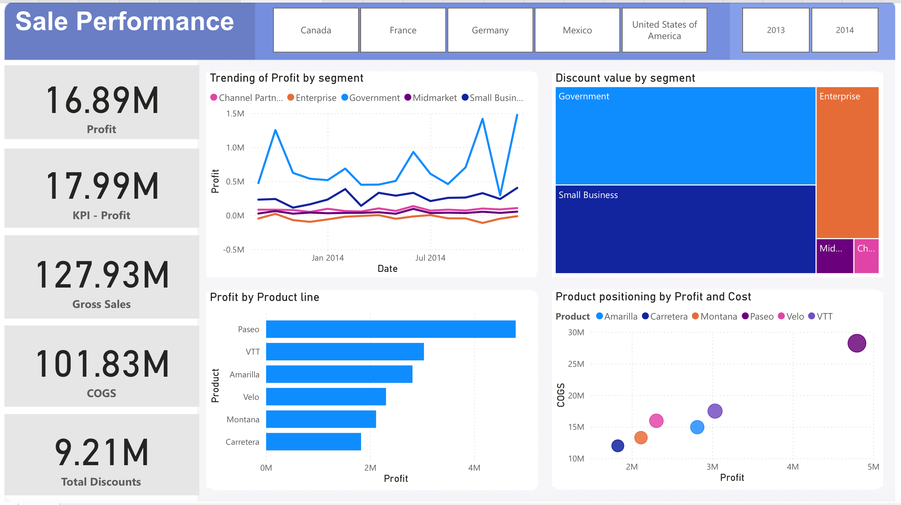

# Miley-Visualization
## Power BI
### 1. Sale Performance Dashboard - Whole process

### 2. [Sale Performance Report](https://app.powerbi.com/reportEmbed?reportId=67071726-6da5-4870-8d07-41dddfb72154&autoAuth=true&ctid=af1f3753-3925-4e6f-949b-97c007320803)
**User Story:**
As a Sales Manager, Adam wants to analyze the sales performance by profit, gross sales, COGS, discounts, and product profitability across different sale channel and time periods, so that he can identify areas of high performance, address inefficiencies, and strategize for better profitability.

**Dashboard snapshot**:[click here](https://app.powerbi.com/reportEmbed?reportId=67071726-6da5-4870-8d07-41dddfb72154&autoAuth=true&ctid=af1f3753-3925-4e6f-949b-97c007320803) It provides insights into:

	1.	Overall Metrics: Profit, Gross Sales, COGS, and Discounts to track performance and profitability.
	2.	Segment Analysis: Profit and discounts by sales channels (e.g., Government, Enterprise) to identify top-performing areas.
	3.	Product Performance: Profitability and cost efficiency by product lines to highlight key contributors and areas for improvement.
	4.	Trends: Profit trends and KPI tracking to monitor performance against targets.
	5.	Positioning: Product profitability vs. costs to identify high-value products and inefficiencies.
 

